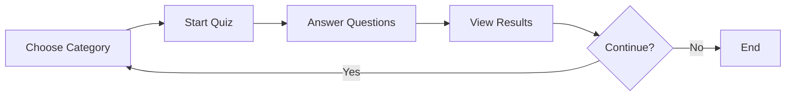

<div align="center">

# 🧠 MindCheck

### Test Your Knowledge, Challenge Your Mind

A modern, interactive quiz application built with Next.js that challenges your knowledge across multiple categories. MindCheck integrates with the Open Trivia Database API to provide fresh questions every time.

[](https://nextjs.org/)
[](https://react.dev/)
[](https://www.typescriptlang.org/)
[](https://tailwindcss.com/)

[Demo](#) • [Features](#-features) • [Installation](#-getting-started) • [Documentation](#-usage)

</div>

---

## ✨ Features

<table>
<tr>
<td>

🎯 **Multiple Quiz Categories**
Choose from 11 different categories including General Knowledge, Science, History, Geography, Sports, and more

</td>
<td>

🔄 **Dynamic Questions**
Fetches fresh questions from the Open Trivia Database API for each quiz session

</td>
</tr>
<tr>
<td>

📡 **Smart Fallback System**
Includes offline support with local question sets if the API is unavailable

</td>
<td>

🔀 **Randomized Options**
Answer choices are shuffled for each question to prevent memorization patterns

</td>
</tr>
<tr>
<td>

📊 **Score Tracking**
Get instant feedback on your performance at the end of each quiz

</td>
<td>

📱 **Responsive Design**
Clean, mobile-friendly interface built with Tailwind CSS

</td>
</tr>
</table>

## 🛠️ Tech Stack

<div align="center">

| Technology | Version | Purpose |
|------------|---------|---------|
| [Next.js](https://nextjs.org/) | 16 | React Framework with App Router |
| [React](https://react.dev/) | 19 | UI Library |
| [TypeScript](https://www.typescriptlang.org/) | 5 | Type Safety |
| [Tailwind CSS](https://tailwindcss.com/) | 4 | Styling |
| [Open Trivia DB](https://opentdb.com/) | API | Question Data Source |

</div>

## 🚀 Getting Started

### Prerequisites

Before you begin, ensure you have the following installed:

```bash
Node.js 20.x or higher
npm / yarn / pnpm / bun
```

### Installation

**1. Clone the repository**

```bash
git clone <repository-url>
cd mindcheck
```

**2. Install dependencies**

```bash
npm install
# or
yarn install
# or
pnpm install
# or
bun install
```

**3. Run the development server**

```bash
npm run dev
# or
yarn dev
# or
pnpm dev
# or
bun dev
```

**4. Open your browser**

Visit [http://localhost:3000](http://localhost:3000) to start using MindCheck 🎉

---

## 📖 Usage

<div align="center">



</div>

1. **🎯 Select a Category** - Choose from 11 different quiz categories on the start screen
2. **▶️ Start the Quiz** - Click the start button to begin your 5-question challenge
3. **✅ Answer Questions** - Select your answer for each multiple-choice question
4. **📊 View Results** - See your final score and performance summary
5. **🔄 Retry or Change Category** - Restart with the same category or choose a different one

---

## 📝 Available Scripts

| Command | Description |
|---------|-------------|
| `npm run dev` | Start the development server with Turbopack |
| `npm run build` | Build the application for production |
| `npm run start` | Start the production server |
| `npm run lint` | Run ESLint to check code quality |

## Project Structure

```
mindcheck/
├── src/
│   └── app/
│       ├── api/                  # API routes
│       │   ├── categories/       # Fetch quiz categories
│       │   └── questions/        # Fetch quiz questions
│       ├── components/           # React components
│       │   ├── start.tsx        # Quiz start screen
│       │   ├── quizCard.tsx     # Quiz question interface
│       │   └── result.tsx       # Results display
│       ├── data/                # Static data
│       │   └── quizData.json    # Fallback questions
│       ├── lib/                 # Utility functions
│       │   └── quiz.ts          # Quiz helpers
│       ├── types/               # TypeScript types
│       │   └── quiz.ts          # Quiz type definitions
│       ├── globals.css          # Global styles
│       ├── layout.tsx           # Root layout
│       └── page.tsx             # Main page component
├── public/                      # Static assets
├── package.json
├── tsconfig.json
└── next.config.ts
```

## API Integration

MindCheck uses the [Open Trivia Database API](https://opentdb.com/) to fetch quiz questions:

- **Categories Endpoint**: `/api/categories` - Retrieves available quiz categories
- **Questions Endpoint**: `/api/questions?category={id}` - Fetches 5 questions for the selected category

The application includes a robust fallback mechanism that uses local question sets if the external API is unavailable, ensuring uninterrupted functionality.

## Available Quiz Categories

- General Knowledge
- Books
- Film
- Music
- Science & Nature
- Computers
- Mathematics
- Sports
- Geography
- History
- Animals

## Development

This project uses:
- **TypeScript** for type safety
- **ESLint** for code quality
- **Tailwind CSS** for styling
- **Next.js App Router** for routing and API routes

## Learn More

To learn more about the technologies used in this project:

- [Next.js Documentation](https://nextjs.org/docs)
- [React Documentation](https://react.dev/)
- [TypeScript Documentation](https://www.typescriptlang.org/docs/)
- [Tailwind CSS Documentation](https://tailwindcss.com/docs)

## Deployment

The easiest way to deploy MindCheck is using the [Vercel Platform](https://vercel.com/new):

[](https://vercel.com/new)

For other deployment options, check out the [Next.js deployment documentation](https://nextjs.org/docs/app/building-your-application/deploying).

## License

This project is private and not licensed for public use.
